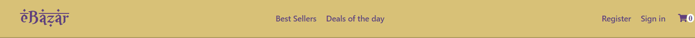

# eBazar
A mobile-first eCommerce website with a middle eastern look and feel built with **React** and **Redux**.

## Features
A sticky-top **NAVBAR** with the following nav links:
* **Logo**: the website logo, which once clicked redirects to the homepage.
* **Best-Sellers**: it displays only items that have been sold from 10000 units and above.
* **Deals of the day**: it displays only items which currently have a discount on their normal price.
* **Register** and **Sign in**: these two are just placeholders as no authentication system has been implemented in this project.
* **Cart**: the cart icon, which shows how many items are currently in the cart and once clicked it redirects to the checkout summary.

