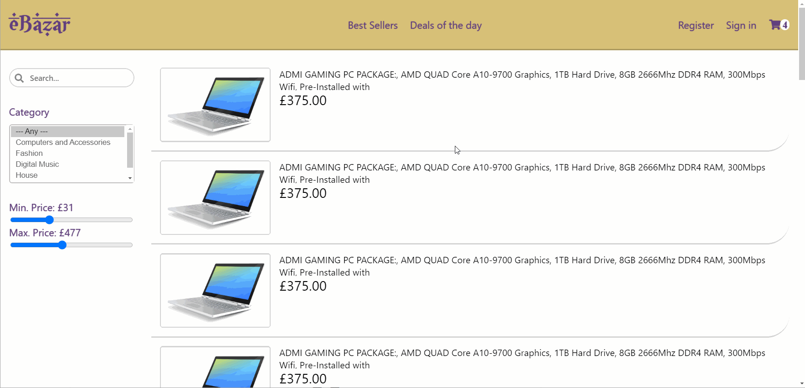
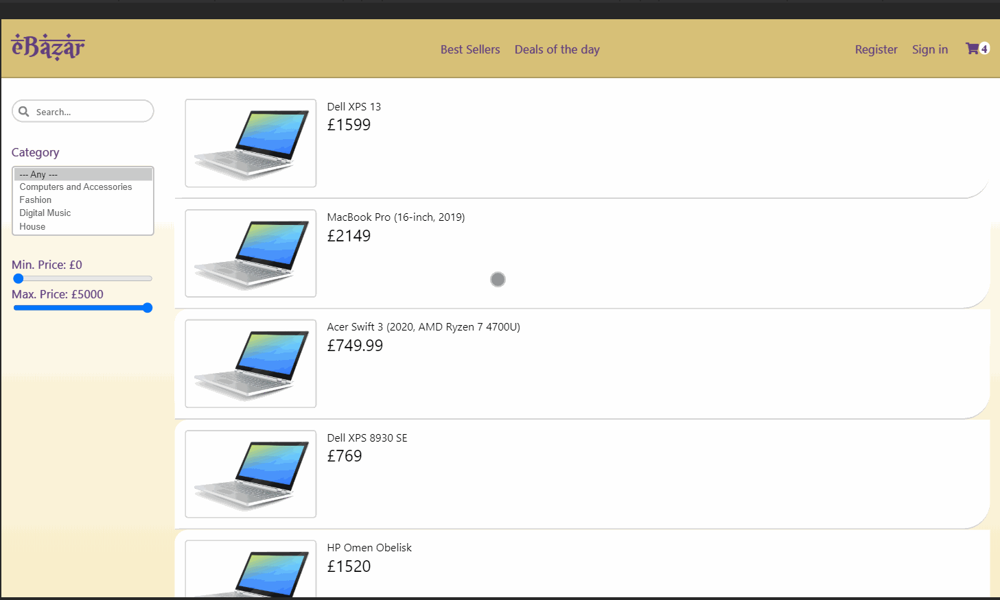
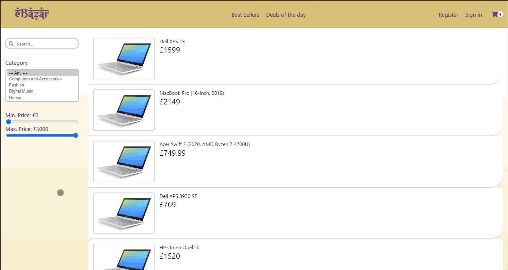
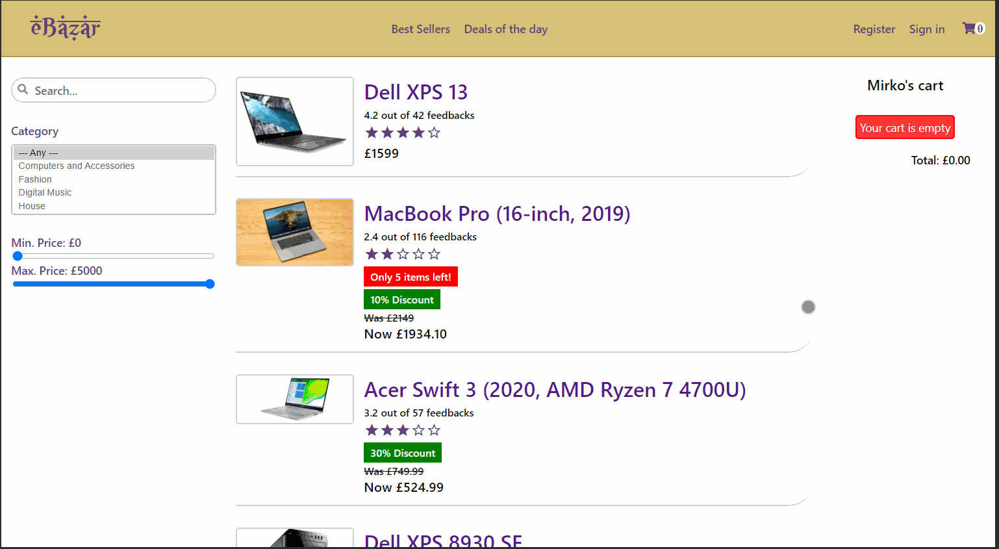

# eBazar
An ecommerce website with a middle eastern look and feel.

## Current stage
The project is meant to showcase my frontend skills and is currently undergoing development.
In fact, the "dummy" backend features a json-server database file containing all the data about the objects displayed.

It is build following a mobile-first approach, using **React** and **Redux**. 

Hereafter, it is possible to appreciate the current stage of the project with the latest features added at the bottom.

## Responsiveness

### Mobile 

### Tablet 

### Desktop 

### Full

## Feature added: filter items by category, department, minimum and maximum price

## Feature added: searchbox allows to filter items by name

## Feature added: display items data and responsive feedback tooltip
(N.B.) the tooltip will only display on hover if using a non-touch device

## Feature added: display item details

## Feature added: add item to cart, decrease quantity, and remove item from cart

