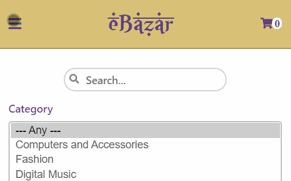
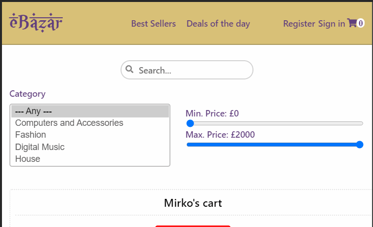
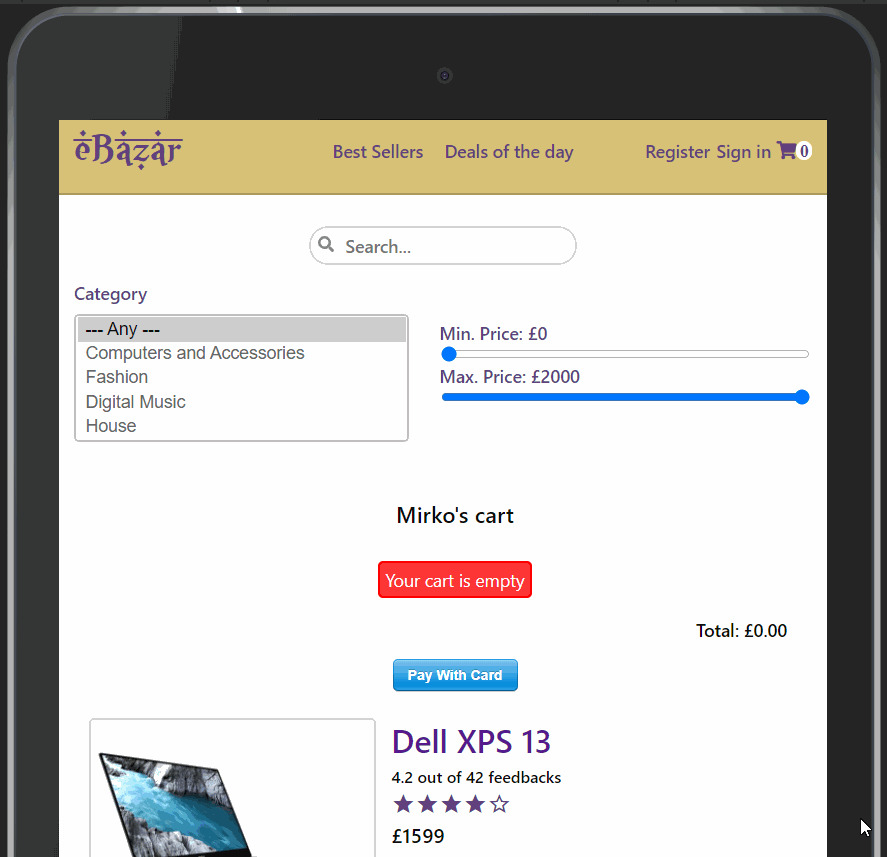
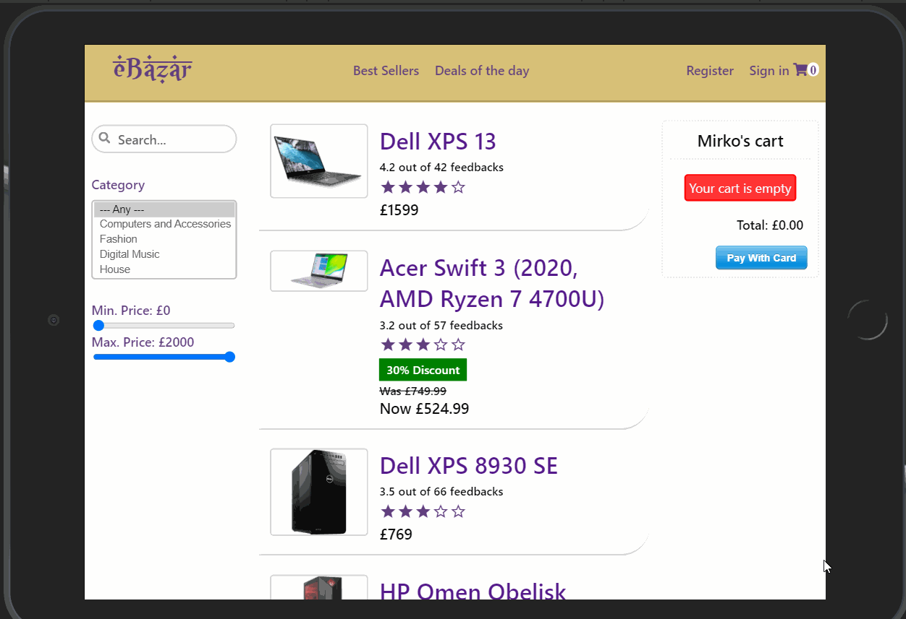

# eBazar
A mobile-first eCommerce website with a middle eastern look and feel built with **React** and **Redux**.

## Features

A sticky-top **NAVBAR** with the following nav links:
* **Logo**: the website logo, which once clicked redirects to the homepage.
* **Best Sellers**: it displays only items that have been sold from 10000 units and above.
* **Deals of the day**: it displays only items which currently have a discount on their normal price.
* **Register** and **Sign in**: these two are just placeholders as no authentication system has been implemented in this project.
* **Cart**: the cart icon, which shows how many items are currently in the cart and once clicked it redirects to the checkout summary page. From here the user can increase/reduce the quantity of a cart item and also completely remove the item.

Also, on a mobile device (i.e. on sceens with maximum with of 600px), the navbar will display a toggle button responsible for expandin/shrinking the Best Sellers, Deals of the day, Register and Sign in links.

A dynamic displaying **ASIDE** comprising the following components:
* **Search Box**: a text input filed in which the user can type in the item he/she is looking for and as a result, all the items containing in their name the characters typed will be displayed in a list.
* **Filter**: a component which filters item based on:
  * **Category**: the category to which the item pertains (e.g. Fashion, Digital Music).
  * **Department**: if a category is selected, the related departments are available to be selected.
  * **Min and Max Price**: selectable as range sliders, these two combined will display only items which current prices are withing the specified range. The Min Price slider goeas from £0 to £450 with a £50 step increase, whereas the Max Price slider goeas from a minimum of £500 to a maximum of £2000 with a £100 step increase.
  

A dynamic displaying **MAIN CONTENT** component comprising:
* **List**: a dynamically generated list of items based on the filters/nav links selected by the user. Every item comprises:
  * an image 
  * a title
  * a feedback section showing the weighted avarage and the rating out of 5 stars
  * a banner informing the user of how many units are on stock if 5 or less items are left
  * a discount banner, if any, showing the up to date price.
* **Cart Summary**: the dinamically generated summary listing all the quantities, items, subtotals and the total price. It also, allows to make a fake payement thanks to Stripe, which simply resets the cart to be empty.

An **ITEM DETAIL** view wich can be accessed by clicking on the item title/name and displays the item features, if any, alongside a dynamic *order* section alongside the details related to the selected item. The order section allows the user to increase/reduce the quantity of a cart item and also completely remove the item via the following buttons:
* **Buy now**: adds one unit of the current item to the cart and takes the user to the chekcout page.
* **Add to cart**: increases the quantity od the selected item. This button is labaled with a plus sign in the checkout summary.
* **Decrease quantity**: laballed with a minus sign. It decreases the selected item quantity in the cart and is rendered only if at list one unit of the current item is already in the cart.
* **Remove Item**: cmpletely removes the current item from the cart.

A **FOOTER** displaying the website author name.

### Examples

* On a mobile phone, the user selects three items and adds them to the cart, two from the *Computers and Accessories* category, and one from the *Sunglasses* department in the *Fashion* category. Once on the checkout page, he/she removes one item from the cart.

* On a tilted mobile phone, the user wants to but an item from the *Computers and Accessories* category that costs between £50 and £500 and a pair of taper pants.

* On a tablet, the use wants to buy one an item that has a discount. Once on the checkout page, he/she adds two more pieces of the same item.

* On a tilted tablet, the user wants to add to the cart an item that has sold more than 10000 units, and an three pieces of an item that costs more than £250. He/She than reduces the quantity to one.

### Fully responsive

